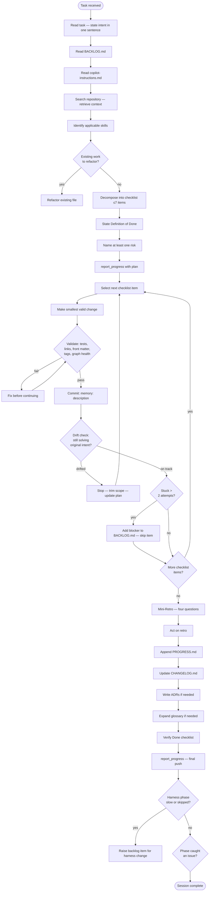

# Build Loop Harness

**Status:** draft

A structured protocol that keeps any [AI agent](../../glossary/ai-agent.md) working in this repository focused, reduces context drift, manages complexity, leverages available [skills](../../glossary/skill.md), and produces a system that measurably improves session over session.

---

## Why a Harness?

Agents working without explicit loop structure exhibit predictable failure modes:

| Failure mode | Symptom |
|---|---|
| Scope creep | PR touches files unrelated to the stated task |
| Context drift | Agent forgets the original intent mid-session |
| Skill blindness | Agent re-derives something a skill already knows |
| Silent breakage | Changes are committed without a validity check |
| Silent stagnation | Session ends without recording what was learned |

The harness prevents all five by making the structure explicit and mandatory.

---

## The Loop

```
┌─────────────────────────────────────────────────────────────────────────┐
│                         BUILD LOOP HARNESS                              │
│                                                                         │
│  ENTRY ──► PLAN ──► EXECUTE ──► VALIDATE ──► CORRECT? ──► CLOSE        │
│                        ▲             │                         │         │
│                        └─── loop ────┘                         │         │
│                                                                 ▼         │
│                                                           SELF-IMPROVE   │
└─────────────────────────────────────────────────────────────────────────┘
```

---

## Phase 1 — Entry

Every session begins here, regardless of how clear the task appears.

1. **Read the task statement.** State the intent in one sentence before touching any file.
2. **Read `BACKLOG.md`.** Check whether the task is already tracked, superseded, or has a prior decision that constrains it.
3. **Read `.github/copilot-instructions.md`.** Apply the constitution. Do not skip this.
4. **Retrieve context.** Search the repository (grep/glob, or the MCP query interface when available) with 2–3 queries that cover the task domain. If results are irrelevant, note it — this is a signal for the retro.
5. **Identify applicable skills.** Scan `.github/skills/` before writing anything. If a skill covers any part of the task, use it. If no skill fits, note the gap in `BACKLOG.md` — do not synthesise a substitute.
6. **Check for existing work.** Ask: does a relevant file already exist that should be refactored rather than duplicated?

**Entry gate:** Do not advance to Plan until you can state the task in one sentence and have confirmed no existing file supersedes the work.

---

## Phase 2 — Plan

Before touching any file, produce a written plan.

1. **Decompose the task** into a numbered checklist. Maximum 7 items. If more items are needed, the scope is too large — split it.
2. **State the Definition of Done** (see §7 of `copilot-instructions.md`).
3. **Name at least one risk or unknown.** If you cannot name one, you have not looked hard enough.
4. **Commit the plan** as a `report_progress` call before making any file changes.

**Plan gate:** Do not advance to Execute until `report_progress` has recorded the checklist.

---

## Phase 3 — Execute Loop

For each item in the plan checklist:

```
┌── Select next checklist item
│
├── Apply the smallest change that satisfies the item
│   • Use ecosystem tools (lint, format, scaffold) in preference to manual edits
│   • Apply relevant skill outputs verbatim where the skill is authoritative
│
├── Validate immediately (see Phase 4)
│
├── Commit with message: memory: <description>
│
├── Drift check: re-read the one-sentence intent from Entry
│   • Am I still solving that problem?
│   • Have I introduced changes outside the checklist scope?
│   If yes to either: pause and go to Phase 5 (Correct)
│
└── Mark checklist item done in report_progress
```

**Context budget rule:** If the conversation context is growing large, pause and summarise the current state before the next item. Drop retrieved snippets that are no longer relevant.

---

## Phase 4 — Validate

After every individual change, before the next checklist item:

| Check | How |
|---|---|
| Behaviour preserved | Run existing tests / lint if available |
| No secrets committed | Scan staged diff for tokens, keys, passwords |
| Links resolve | Any new cross-links point to files that exist |
| Front matter complete | New `.md` files have all required YAML fields |
| Tags are canonical | New tags checked against existing tag vocabulary |
| Knowledge graph health | 3 related files identified and linked |

If any check fails: fix it before moving to the next item. Do not accumulate debt.

---

## Phase 5 — Correct

Triggered when the drift check (Phase 3) or a validation failure (Phase 4) signals a problem.

**Drift correction:**
1. Stop the current item.
2. Re-read the one-sentence intent from Entry.
3. Identify the furthest point at which the approach was still correct.
4. Revert or scope-trim from that point.
5. Update the plan checklist to reflect what actually needs to happen.
6. Log the correction in `report_progress`.

**Stuck correction** (same item fails twice):
1. Note the blocker as a new `BACKLOG.md` item.
2. Move past the item — do not spin.
3. Record the skip in the plan checklist with a ↩ marker and a one-line reason.

**Wrong assumption:**
1. Update the plan checklist to cross out the invalidated assumption.
2. Add a replacement item.
3. Log the assumption change in `report_progress`.

---

## Phase 6 — Close

Every session ends with a full close sequence. This is not optional.

1. **Mini-Retro** (four questions from §7 of `copilot-instructions.md`):
   - Did the process work?
   - What slowed down or went wrong?
   - What single change would prevent this next time?
   - Is this a pattern?
2. **Act on the retro** — do not just answer the questions. If the answer is "document it", document it now. If it is "add a backlog item", add it now.
3. **Append to `PROGRESS.md`** — dated entry with session summary and mini-retro.
4. **Update `CHANGELOG.md`** under `[Unreleased]` if any user-visible behaviour changed.
5. **Write ADRs** for any non-trivial architectural or design decisions made this session.
6. **Expand the glossary** for any new terms introduced.
7. **Verify the "Done" checklist** from §7 of `copilot-instructions.md` item by item.
8. **Run `report_progress`** one final time to push all changes.

---

## Phase 7 — Self-Improve

After the close sequence, before ending the session:

Ask these three questions about the **harness itself**, not just the work:

1. **Was any phase slow or skipped?** If a phase felt unnecessary for this task, was that because the task was simple, or because the harness has redundant structure? If the latter, propose a change.
2. **Did any phase catch something that would otherwise have been missed?** This is evidence the phase earns its cost. Note it.
3. **Was the loop the right granularity?** If checklist items were too coarse (each contained implicit sub-steps) or too fine (trivial items padded the list), adjust the decomposition rule for next time.

If a change to this document is warranted, raise a backlog item. Changes to the harness itself require an ADR — the harness is an architectural decision.

---

## Focus Rules

These rules keep the agent on the critical path:

| Rule | Enforcement |
|---|---|
| One task per session | If a second task surfaces mid-session, add it to `BACKLOG.md` and stay on the current task |
| No orphan improvements | Improvements spotted but unrelated to the current task go to `BACKLOG.md`, not into the current PR |
| Scope declared at Entry | Any file change outside the Entry scope requires an explicit justification in `report_progress` |
| Skills before scratch work | If a skill exists for the task, its output is canonical — do not re-derive |
| Retro is mandatory | A session without a mini-retro is not done |

---

## Relationship to Existing Conventions

| Convention | Where defined | How the harness uses it |
|---|---|---|
| Mini-Retro | `copilot-instructions.md` §7 | Phase 6 step 1 |
| "Done" checklist | `copilot-instructions.md` §7 | Phase 6 step 7 |
| ADR protocol | `copilot-instructions.md` §4, `docs/adr/` | Phase 6 step 5, Phase 7 |
| Backlog management | `copilot-instructions.md` §3, `BACKLOG.md` | Entry step 2, Phase 5, Phase 7 |
| Skill usage | `copilot-instructions.md` §2 | Entry step 5, Focus Rules |
| Chain-of-thought | `copilot-instructions.md` §13 | Integrated throughout Execute |
| Knowledge graphing | `copilot-instructions.md` §7 | Phase 4 validation |

---

## Mermaid Diagram



---

## Open Questions

1. **Parallel execution** — when a task decomposes into independent sub-tasks, can the loop run sub-agents in parallel? If so, how do drift checks coordinate across branches?
2. **Harness versioning** — should this document carry a version number so that `copilot-instructions.md` can pin to a specific harness version?
3. **Context budget enforcement** — is there a mechanical way (e.g. a token-count check) to trigger the summarise-and-prune step, or is it always a judgment call?

---

## Related

- [`.github/copilot-instructions.md`](../../.github/copilot-instructions.md) — the constitution this harness operates within
- [`docs/design/ontology-system-design.md`](./ontology-system-design.md) — example of a multi-phase design document produced using a prior iteration of this loop
- [`docs/adr/README.md`](../adr/README.md) — ADR index; harness changes require an ADR
- [`BACKLOG.md`](../../BACKLOG.md) — work items raised during harness execution
