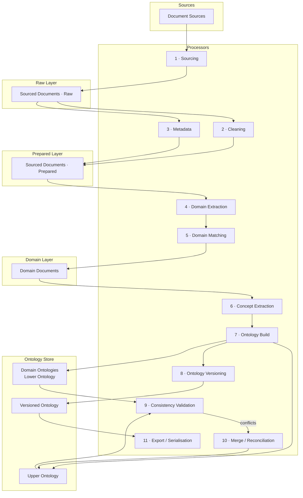
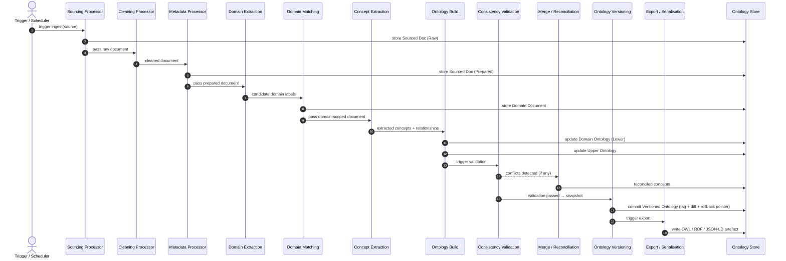

# Ontology-Based Memory System — Design

**Status:** draft
**Date:** 2026-05-23
**Supersedes:** n/a
**Related ADRs:** [ADR-0002](../adr/0002-move-from-vector-storage-to-ontology.md) · [ADR-0003](../adr/0003-ontology-architecture.md)

---

## 1. Purpose

This document describes the conceptual architecture for the ontology-based [Memory System](../../README.md). It covers the key components, the processing pipeline that transforms raw documents into versioned ontologies, and the relationships between them.

This is a **design-space document** — it operates in the conceptual plane. Implementation details (specific libraries, file formats, API contracts) are deferred to implementation ADRs.

---

## 2. Architectural Components

### 2.1 Documents

| Component | Description |
|-----------|-------------|
| **Document** | Any information artefact in scope — structured (tables, schemas), semi-structured (Markdown, HTML), or lexical (plain prose) |
| **Document Source** | The origin of a document — a URL, API, file system path, RSS feed, database export, etc. |
| **Sourced Document (Raw)** | A verbatim copy of the document as retrieved from the source. Never modified after capture. Preserves full fidelity including markup, images, and encoding artefacts |
| **Sourced Document (Prepared)** | A cleaned representation of a raw sourced document. Markup, images, and non-readable characters are removed. Enriched with metadata: source URI, retrieval timestamp, retrieval method, MIME type, document lineage, and any tags or labels present on the original |
| **Domain Document** | A prepared document that has been assigned to one or more domains in the upper ontology. The scoped unit of input to concept extraction |

### 2.2 Document Collections

| Component | Description |
|-----------|-------------|
| **Sourced Documents** | The complete set of all documents (raw and prepared) that have been ingested into the system |
| **Domain Documents** | The subset of prepared documents assigned to a specific domain, forming the input corpus for that domain's ontology |

### 2.3 Ontology Components

| Component | Description |
|-----------|-------------|
| **Upper Ontology** | The top-level taxonomy of all recognised domains and their relationships. Domain-agnostic. Defines what domains exist and how they relate to each other |
| **Domain Ontology** | A concept graph scoped to a single domain. Contains the concepts, properties, axioms, and relationships extracted from that domain's document corpus |
| **Lower Ontology** | The collective name for the full set of domain ontologies |
| **Versioned Ontology** | A snapshot of the upper and/or lower ontology at a specific point in time, tagged with a semantic version, accompanied by a diff and rollback pointer |

---

## 3. Architectural Processors

Processors are the units of transformation in the pipeline. Each processor has a defined input type, output type, and responsibility boundary.

| # | Processor | Input | Output | Responsibility |
|---|-----------|-------|--------|----------------|
| 1 | **Sourcing Processor** | Document Source | Sourced Document (Raw) | Fetches and stores a verbatim copy of a document from its source |
| 2 | **Cleaning Processor** | Sourced Document (Raw) | Sourced Document (Prepared) — content | Removes markup, images, non-readable characters, and encoding noise |
| 3 | **Metadata Processor** | Sourced Document (Raw) + source context | Sourced Document (Prepared) — metadata | Attaches source URI, retrieval time, method, MIME type, lineage, and original tags |
| 4 | **Domain Extraction Processor** | Sourced Document (Prepared) | Domain signals (candidate domain labels) | Identifies which domain(s) the document belongs to by analysing its content |
| 5 | **Domain Matching Processor** | Domain signals | Domain Document | Maps candidate domain labels to canonical domains in the upper ontology |
| 6 | **Concept Extraction Processor** | Domain Document | Concepts + relationships | Extracts named entities, properties, and axioms from domain-scoped text |
| 7 | **Ontology Build Processor** | Concepts + relationships | Domain Ontology; updated Upper Ontology | Constructs or updates the domain ontology; merges domain-level concepts into the upper ontology |
| 8 | **Ontology Versioning Processor** | Ontology snapshot | Versioned Ontology artefact | Diffs, tags, and commits an immutable ontology version with a changelog and rollback pointer |
| 9 | **Consistency Validation Processor** | Domain Ontology set | Validation report | Detects contradictions, circular definitions, and broken axioms across domain ontologies before a version is committed |
| 10 | **Ontology Merge / Reconciliation Processor** | Conflicting domain concepts | Canonical merged representation | Resolves concept collisions when two domain ontologies claim the same term with differing definitions |
| 11 | **Export / Serialisation Processor** | Internal ontology representation | OWL / RDF-Turtle / JSON-LD | Converts the ontology to standard interchange formats for archival, tooling, and downstream consumers |

---

## 4. Component Diagram

The diagram below shows the components and their data-flow relationships.

---

## 5. Sequence Diagram

The diagram below shows the end-to-end flow for ingesting a single document and incorporating its concepts into the versioned ontology.

---

## 6. Open Questions

- [ ] What is the internal representation format for domain ontologies before serialisation (RDF graph in-memory, property graph, custom AST)?
- [ ] How are domain boundaries enforced — single-domain documents only, or can a document span multiple domains?
- [ ] How is the upper ontology seeded — manually authored, bootstrapped from a standard upper ontology (BFO, SUMO, schema.org), or both?
- [ ] What triggers a version commit — every document ingest, a scheduled batch, or a manual gate?
- [ ] How are conflicting domain ontology versions handled during a merge when both are "accepted"?
- [ ] What is the rollback mechanism — swap the active pointer, or replay from source documents?

---

## References

1. [ADR-0002 — Move from vector storage to ontology](../adr/0002-move-from-vector-storage-to-ontology.md)
2. [ADR-0003 — Ontology architecture](../adr/0003-ontology-architecture.md)
3. [Basic Formal Ontology (BFO)](https://basic-formal-ontology.org/) — reference upper ontology
4. [OWL 2 Web Ontology Language](https://www.w3.org/TR/owl2-overview/) — target serialisation standard
5. [Mermaid — diagram-as-code](https://mermaid.js.org/) — diagramming syntax used above
