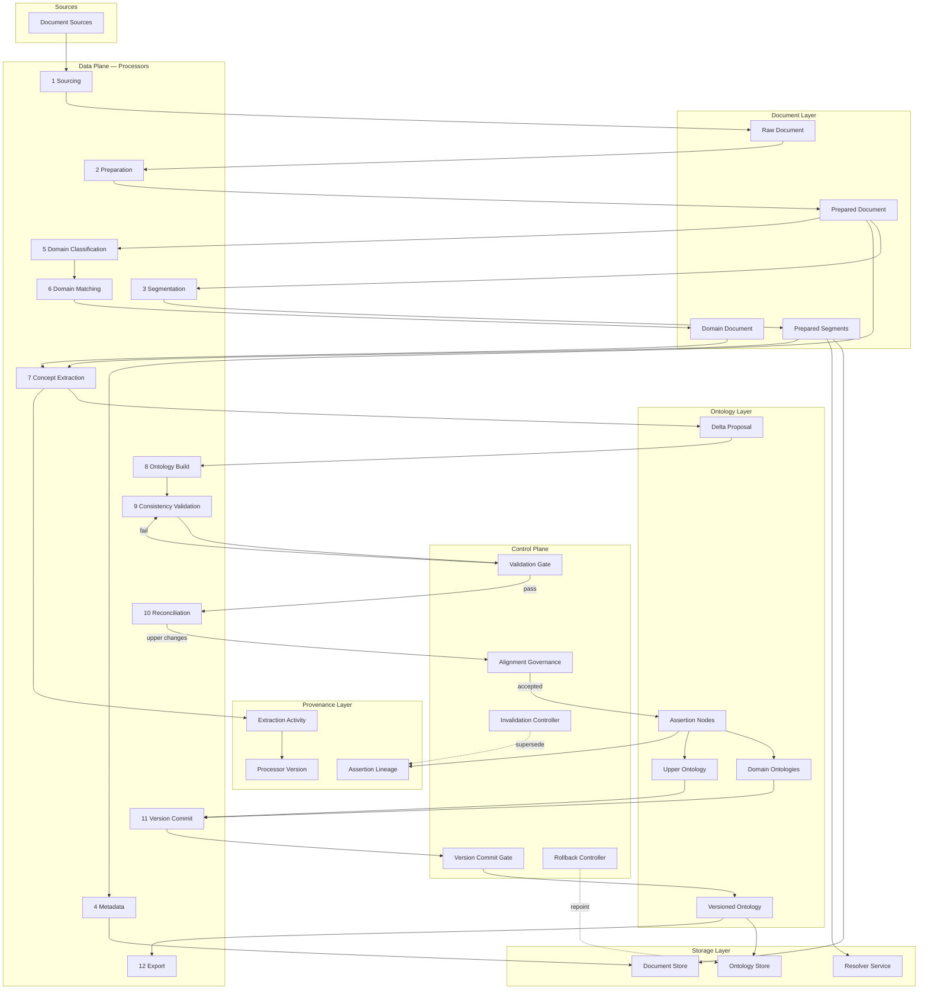
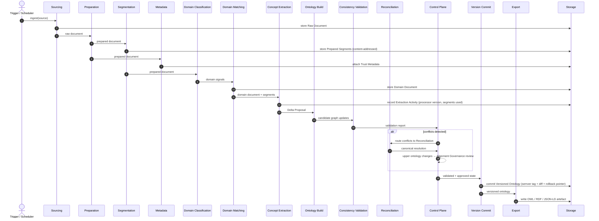

# Ontology-Based Memory System — Design

**Status:** draft
**Version:** 2
**Date:** 2026-05-23
**Supersedes:** v1 (initial design, same file)
**Related ADRs:** [ADR-0002](../adr/0002-move-from-vector-storage-to-ontology.md) · [ADR-0004](../adr/0004-provenance-model-and-control-plane.md)

---

## 1. Purpose

This document describes the conceptual architecture for the ontology-based [Memory System](../../README.md). It covers the key components, the processing pipeline that transforms raw documents into versioned ontologies, and the relationships between them.

This is a **design-space document** — it operates in the conceptual plane. Implementation details (specific libraries, file formats, API contracts) are deferred to implementation ADRs.

---

## 2. Architectural Principles

Six constraints govern all design decisions. See [ADR-0004](../adr/0004-provenance-model-and-control-plane.md) for rationale.

| Principle | Constraint |
|-----------|-----------|
| **Immutable Source Fidelity** | Raw source artefacts are stored verbatim and never modified |
| **Deterministic Transformation** | Every derived artefact is reproducible from source + processor version |
| **Assertion Provenance** | Every accepted ontology assertion must resolve to at least one supporting Prepared Segment |
| **Control/Data Separation** | Transformation processors (data plane) are distinct from governance and version control (control plane) |
| **Upper Ontology Stability** | Upper ontology mutations require explicit alignment governance acceptance |
| **Bidirectional Traceability** | Concepts resolve to source evidence; source evidence resolves to derived assertions |

---

## 3. Architectural Components

### 3.1 Document Layer

| Component | Description |
|-----------|-------------|
| **Document** | Any information artefact in scope — structured (tables, schemas), semi-structured (Markdown, HTML), or lexical (plain prose) |
| **Document Source** | External origin: URL, API, filesystem path, feed, database export |
| **Raw Document** | Immutable verbatim capture of the source artefact — never modified after capture |
| **Prepared Document** | Canonical cleaned representation with structured metadata attached |
| **Prepared Segment** | Immutable, content-addressed fragment of a Prepared Document. Identified by a SHA-256 content URI. The atomic unit of evidence for assertion provenance |
| **Domain Document** | A prepared document assigned to one or more domains in the upper ontology |

### 3.2 Ontology Layer

| Component | Description |
|-----------|-------------|
| **Upper Ontology** | Stable domain taxonomy and alignment model. Mutates only through governed acceptance |
| **Domain Ontology** | Domain-scoped concept graph; the lower ontology tier |
| **Lower Ontology** | The collective set of all domain ontologies |
| **Ontology Delta Proposal** | Candidate assertions produced by extraction — not yet accepted into the graph |
| **Assertion Node** | An accepted ontology fact with confidence score and provenance links |
| **Versioned Ontology** | Immutable snapshot of the ontology at a point in time, tagged with a semantic version, carrying a semantic diff and rollback pointer |

### 3.3 Provenance Layer

| Component | Description |
|-----------|-------------|
| **Extraction Activity** | Recorded execution of a Concept Extraction Processor that produced a set of candidate assertions |
| **Processor Version** | Versioned identity (name + semver) recorded on every Extraction Activity |
| **Assertion Lineage** | Supersession and invalidation history of an Assertion Node across versions |
| **Trust Metadata** | Attached to a Document Source or Prepared Document: `source_authority` (authoritative / secondary / inferred / unknown), `freshness_date` (ISO-8601), `approval_state` (pending / accepted / rejected) |

### 3.4 Storage Layer

| Component | Description |
|-----------|-------------|
| **Document Store** | Object storage for raw artefacts, prepared documents, and segments |
| **Ontology Store** | Graph store for current ontology state (triple store or property graph — deferred) |
| **Resolver Service** | Maps content-addressed URIs (`sha256:…`) to physical storage locations |

---

## 4. Processing Architecture

### 4.1 Data Plane — Processors

Processors transform artefacts. Each has a defined input, output, and sole responsibility.

| # | Processor | Input | Output | Responsibility |
|---|-----------|-------|--------|----------------|
| 1 | **Sourcing Processor** | Document Source | Raw Document | Capture immutable source verbatim |
| 2 | **Preparation Processor** | Raw Document | Prepared Document | Clean and normalise content |
| 3 | **Segmentation Processor** | Prepared Document | Prepared Segments | Split into content-addressed, immutable fragments |
| 4 | **Metadata Processor** | Source + Prepared Document | Metadata Envelope | Attach retrieval, lineage, and trust metadata |
| 5 | **Domain Classification Processor** | Prepared Document | Domain Signals | Candidate domain labels from content analysis |
| 6 | **Domain Matching Processor** | Domain Signals | Domain Document | Map candidates to canonical upper ontology domains |
| 7 | **Concept Extraction Processor** | Domain Document + Segments | Delta Proposal + Extraction Activity | Extract candidate assertions with segment evidence links |
| 8 | **Ontology Build Processor** | Delta Proposal | Candidate Domain Updates | Construct or update domain ontology graph |
| 9 | **Consistency Validation Processor** | Candidate Updates | Validation Report | Detect contradictions, circular definitions, collisions |
| 10 | **Reconciliation Processor** | Validation Conflicts | Canonical Merge Resolution | Resolve semantic conflicts; route upper ontology changes to Alignment Governance |
| 11 | **Version Commit Processor** | Validated Graph State | Versioned Ontology | Tag, diff, and commit an immutable snapshot |
| 12 | **Export Processor** | Versioned Ontology | OWL / RDF-Turtle / JSON-LD | Serialise for external tooling and archival |

### 4.2 Control Plane

Controls govern state transitions. They are distinct from data processors.

| Control | Responsibility |
|---------|----------------|
| **Validation Gate** | Blocks promotion of any graph state that fails consistency validation |
| **Alignment Governance** | Reviews and accepts or rejects proposed upper ontology mutations |
| **Version Commit Gate** | Commits a validated, approved graph state as a new immutable version |
| **Rollback Controller** | Reverts the active ontology pointer to a prior version; does not delete history |
| **Invalidation Controller** | Marks Assertion Nodes as superseded when contradicting evidence is accepted |

---

## 5. Component Diagram



---

## 6. Sequence Diagram

End-to-end flow for ingesting a single document.



---

## 7. Provenance Example

An assertion in the ontology links back through an Extraction Activity to the Prepared Segment that evidences it.

```turtle
@prefix ex:   <https://memory.example.org/> .
@prefix prov: <http://www.w3.org/ns/prov#> .
@prefix xsd:  <http://www.w3.org/2001/XMLSchema#> .

ex:assertion/001
    a ex:AssertionNode ;
    ex:claim "LanceDB is an embedded vector database" ;
    ex:confidence "0.92"^^xsd:decimal ;
    ex:evidencedBy ex:segment/abc123 ;
    prov:wasGeneratedBy ex:activity/extract-2026-05-23-001 .

ex:activity/extract-2026-05-23-001
    a ex:ExtractionActivity ;
    prov:used ex:segment/abc123 ;
    prov:wasAssociatedWith ex:processor/concept-extractor-v1.2.0 ;
    prov:endedAtTime "2026-05-23T04:00:00Z"^^xsd:dateTime .

ex:segment/abc123
    a ex:PreparedSegment ;
    ex:contentHash "sha256:e3b0c44298fc1c149afbf4c8996fb924..." ;
    ex:sourceDocument ex:doc/lancedb-overview-2026 .
```

---

## 8. Open Questions

- [ ] What is the confidence weighting model for Trust Metadata — numeric score, tier-based, or rule-derived?
- [ ] Is Alignment Governance a human approval gate, an automated check, or context-dependent?
- [ ] How does rollback propagate when domain ontologies depend on an upper ontology version being rolled back?
- [ ] What triggers a Version Commit — every ingest, scheduled batch, or manual gate?
- [ ] Can a document span multiple domains, and if so, how are conflicting domain assignments resolved?
- [ ] How is the upper ontology seeded — manually authored, bootstrapped from BFO/SUMO/schema.org, or hybrid?
- [ ] What is the internal representation format before serialisation (RDF graph, property graph, custom AST)?

---

## References

1. [ADR-0002 — Move from vector storage to ontology](../adr/0002-move-from-vector-storage-to-ontology.md)
2. [ADR-0004 — Provenance model and control plane](../adr/0004-provenance-model-and-control-plane.md)
3. [W3C PROV-O](https://www.w3.org/TR/prov-o/) — provenance ontology used in the example
4. [Basic Formal Ontology (BFO)](https://basic-formal-ontology.org/) — reference upper ontology
5. [OWL 2 Web Ontology Language](https://www.w3.org/TR/owl2-overview/) — target serialisation standard
6. [Mermaid — diagram-as-code](https://mermaid.js.org/) — diagramming syntax used above

